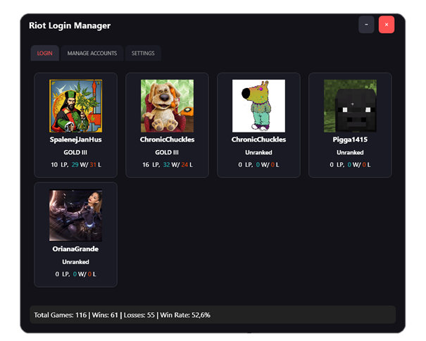
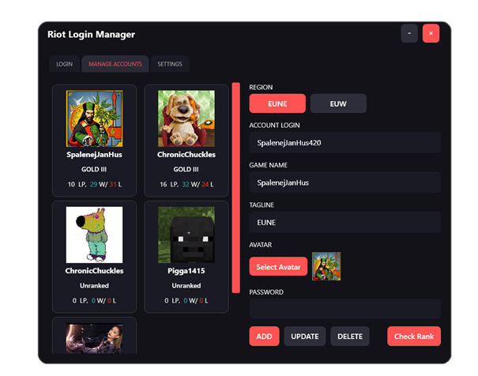
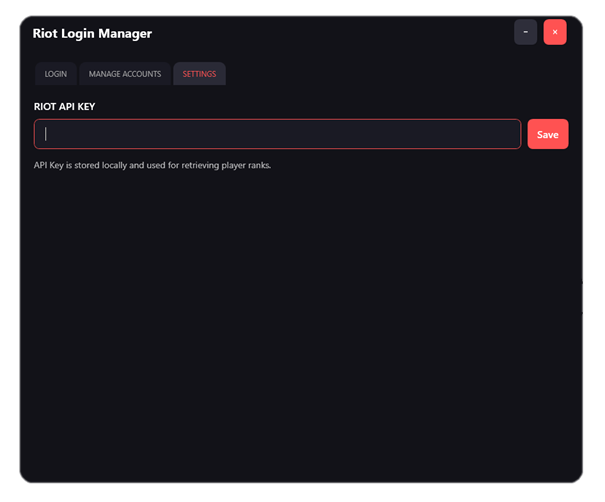

# Riot Auto Login App

## Overview

**Riot Auto Login App** is a user-friendly application designed to automate the login process for the Riot Client while securely managing multiple Riot accounts. It integrates with the Riot API to fetch and display player stats and rank information. The application features a modern, minimalist user interface with dedicated tabs for login, account management, and settings.

## Key Features

- **Automated Login:**  
  Launch and automatically log in to the Riot Client with a double-click on an account card.
  
- **Multi-Account Management:**  
  Easily add, update, or delete multiple Riot accounts. Manage all your login credentials in one place.
  
- **Riot API Integration:**  
  Retrieve live rank and stats data directly from the Riot API to keep your account information up to date.
  
- **Security & Privacy:**  
  User credentials are secured using the Windows Data Protection API (DPAPI) with added entropy, ensuring your sensitive information is safely encrypted and stored locally.
  
- **Self-contained Deployment:**  
  The app is published as a self-contained executable with all required dependencies, ensuring easy distribution without needing to install the .NET runtime separately.

## Installation

### Requirements

- **Operating System:** Windows  
- **Dependencies:** No additional installations are needed when using the self-contained publish version.

### How to Get Started

1. **Download the App:**  
   Obtain the self-contained executable from the releases section.
   
2. **Run the Application:**  
   Simply double-click the executable to launch the app.

## How to Use the App

### 1. Login Tab

- **Purpose:** Quickly log in to your Riot Client.  
- **Instructions:**  
  - Browse your list of accounts.
  - Double-click on the desired account card to launch the Riot Client and automatically fill in your credentials.
  
- **Screenshot:**  
  

### 2. Manage Accounts Tab

- **Purpose:** Add, update, or remove Riot accounts.  
- **Instructions:**  
  - Enter account details such as Account Login, Game Name, Tagline, and Password.
  - Optionally, select an avatar for the account.
  - Click **Add**, **Update**, or **Delete** to manage your account list.
  
- **Screenshot:**  
  

### 3. Settings Tab

- **Purpose:** Configure your Riot API key to enable API integration.  
- **Instructions:**  
  - Enter your Riot API key in the provided text box.
  - Click **Save** to store the API key securely.
  
- **Screenshot:**  
  

## Requesting Your Riot API Key

To fully utilize the app's capabilities, you need your own API key from Riot Games. Follow these steps:

1. **Visit the Riot Developer Portal:**  
   Go to [Riot Developer Portal](https://developer.riotgames.com/).

2. **Sign Up or Log In:**  
   Create an account or log in if you already have one.

3. **Request an API Key:**  
   Navigate to the Dashboard section and click on register product. There u can request for personal api key that is free to use for smaller apps.

4. **Enter the API Key in the App:**  
   Open the **Settings Tab** in the app and input your new API key, then click **Save**.

## Security & Privacy

- **Encryption:**  
  Passwords and sensitive data are encrypted using the Windows Data Protection API (DPAPI) with additional entropy. This ensures that your credentials are stored securely on your local machine.

- **Self-contained Packaging:**  
  The application is packaged with all necessary dependencies (including the .NET runtime). While this results in a larger file size, it guarantees that the app will run on any compatible Windows machine without additional installations.

- **Privacy:**  
  Your API key and account credentials are stored only on your local device and are not transmitted to any external servers.

## Troubleshooting

- **Login Issues:**  
  Make sure that the Riot Client is installed on your system and that its installation path is correct if you encounter issues during login.

- **API Key Errors:**  
  Ensure that your API key is valid and active. Visit the Riot Developer Portal for any updates regarding your key.

## Contributing

Contributions are welcome! If you would like to contribute to the project, please fork the repository and submit a pull request. For major changes, please open an issue first to discuss what you would like to change.

## License

This project is licensed under the [MIT License](LICENSE).
